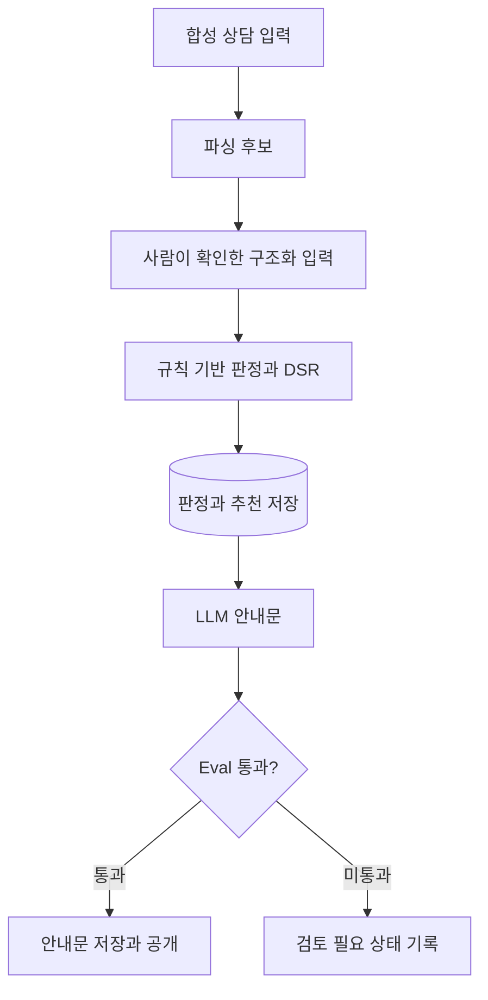

# 개발자 가이드

이 서비스는 **합성 상담 정보를 사람이 확인하고, 코드가 판정한 결과를 LLM이 설명하는 대출 상담 의사결정 지원 데모**다. 처음 읽는 개발자는 아래 순서로 서비스의 목적, 실행 경계, 데이터와 HTTP 계약을 확인할 수 있다.

| 순서 | 문서 | 답하는 질문 |
|---|---|---|
| 1 | [문제 정의와 Use Case](서비스_문제와_유스케이스.md) | 누구의 어떤 문제를 다루고, 무엇을 할 수 있는가? |
| 2 | [아키텍처](아키텍처.md) | 화면·API·코어·LLM·DB는 어디서 실행되고 연결되는가? |
| 3 | [데이터 흐름](데이터_흐름.md) | 입력부터 판정·설명 저장까지 어떤 순서와 트랜잭션을 거치는가? |
| 4 | [데이터 모델](데이터모델.md) | 여섯 테이블은 어떤 관계와 제약을 갖는가? |
| 5 | [API 명세서](API_명세서.md) | 어떤 요청을 보내고 응답·오류·재시도를 어떻게 처리하는가? |
| 6 | [설계 결정](설계결정.md) · [평가 리포트](평가리포트.md) | 왜 이 구조인가? 무엇을 검증했는가? |

## 서비스의 중심 흐름

판정은 설명 생성보다 먼저 저장된다. 따라서 안내문 생성 실패가 이미 저장된 판정을 지우거나 바꾸지 않는다. 다만 이것은 **저장된 구조화 입력에 대한 결정성**이다. 사람이 파싱 오류를 발견하지 못한 채 입력을 확정하면, 잘못된 입력에 대해 결정적으로 계산할 수 있다. 구현은 [심사 생성](../loan_agent/api/assessments.py)의 `_persist`와 [설명 실행기](../loan_agent/worker.py)의 `_finish`에서 확인한다.

## 현재 제공 범위

| 기능 | 공개 화면 | 로컬 API / 실행기 |
|---|---|---|
| 규칙 파서로 폼 채우기·수정·금액 확인 | 제공 | `parsing-preview`에서 규칙 후보 반환 |
| LLM·규칙 파서 후보 비교 | 화면 미연결 | 방문자 키를 보낸 `parsing-preview`에서 제공 |
| 결정적 판정·DSR·합성 상품 추천 | 키 없이 제공 | `POST /api/v1/assessments` |
| 새로운 안내문 생성 | 방문자 키로 동기 실행 | 방문자 키 동기 실행 / 서버 키 워커 비동기 실행 |
| 과거 심사 검색·설명 이력 조회 | 전용 화면 없음 | 조회 API 제공 |
| 사전 녹화 결과 열람 | 키 없이 제공 | `GET /api/v1/demo-cases` |
| 인증·자원 소유권 구분 | 없음 | 없음 |

공개 호스트는 화면만 노출한다. `https://loan.gwang.dev/api/v1/...`를 API 주소로 사용하지 않는다. 로컬 실행과 Swagger 접속은 [README](../README.md#빠른-실행), 운영 구성은 [아키텍처](아키텍처.md)를 따른다.

## 문서의 기준과 갱신

- 이 문서 묶음은 **2026-09-13 작업 트리의 구현과 배포 설정**을 설명한다. 운영 서버의 현재 상태를 새로 실측했다는 뜻은 아니다.
- 요구사항과 허용된 HTTP 경로는 [SPEC.yaml](../SPEC.yaml), 실제 입출력은 [라우터](../loan_agent/api/), 스키마는 [Alembic 마이그레이션](../alembic/versions/)을 근거로 한다. 차이가 있으면 실제 동작과 한계를 함께 명시한다.
- 다이어그램 원본은 각 Markdown의 Mermaid 블록이다. GitHub에서 렌더링되며, 이미지 대신 원본을 수정해 코드와 함께 변경 이력을 남긴다.
- API 변경 시 API 명세서, 실행 주체 변경 시 아키텍처·데이터 흐름, 스키마 변경 시 데이터 모델을 함께 갱신한다.

실제 대출 승인·거절과 상품 중개를 수행하지 않는다. 실제 개인정보를 입력하지 않는 합성 데이터 데모이며, 실서비스 전환 과제는 [리스크 통제 대장](리스크_통제_대장.md)에 정리돼 있다.
