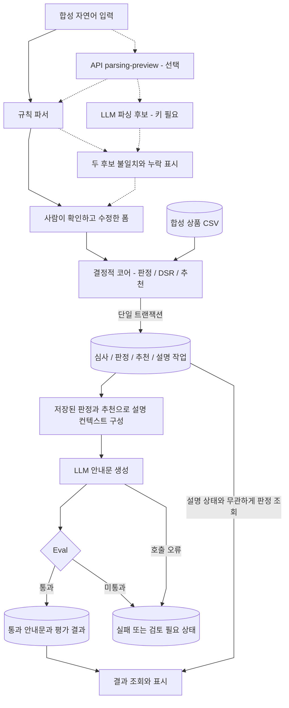
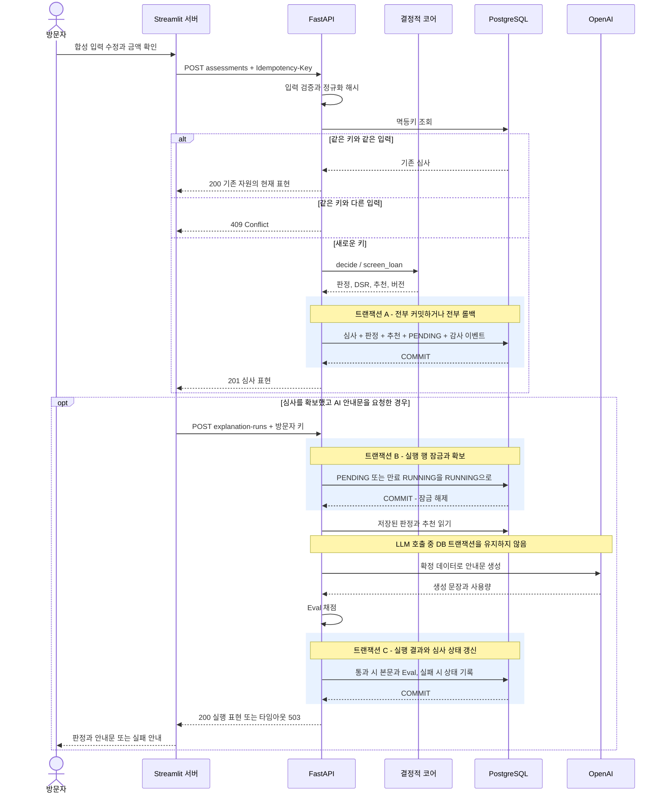
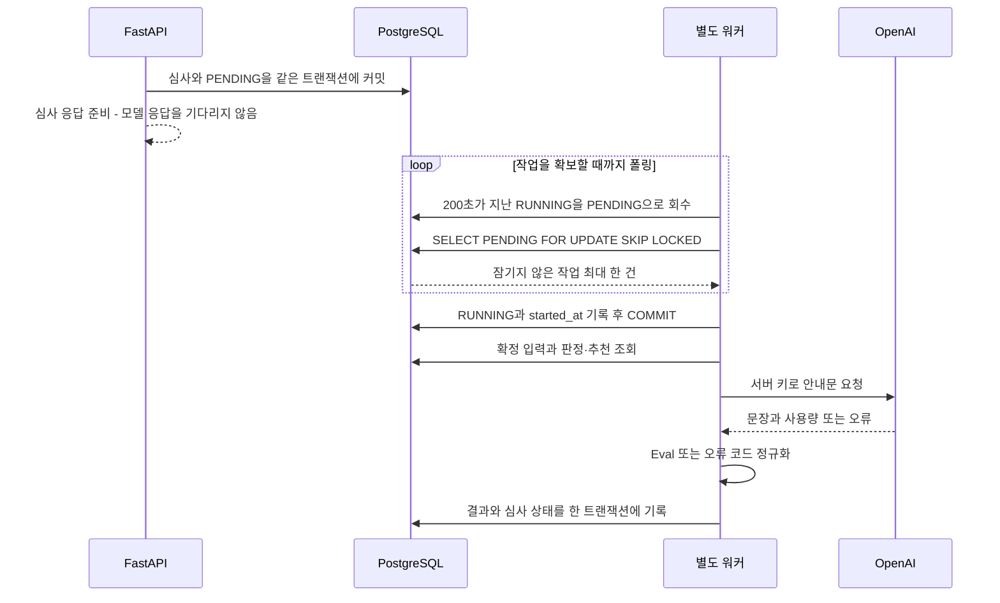

# 데이터 흐름

[개발자 가이드](개발자_가이드.md) · [아키텍처](아키텍처.md) → 데이터 흐름 → [데이터 모델](데이터모델.md)

## 입력부터 공개까지

실선은 실제 데이터 이동, 점선은 선택적 API 파싱 경로다. 공개 화면은 규칙 파서로 폼을 채우며, LLM 파싱 후보를 자동으로 판정에 넣지 않는다.

자연어·전체 프롬프트는 저장 경로에 넣지 않는다. 설명 단계의 외부 전송 내용은 판정·DSR·추천 상세이고, API 파싱 기능에 키를 보내면 그때는 자연어 입력도 외부 모델로 전송된다. 두 경우 모두 합성 입력만 사용한다. 근거: [parsing](../loan_agent/api/parsing.py), [llm](../loan_agent/llm.py), [worker의 `_guidance_context`](../loan_agent/worker.py).

## 공개 데모: 심사 저장과 방문자 키 실행

선조회 뒤 동시 삽입 경쟁은 DB의 멱등키 UNIQUE가 최종 처리한다. 같은 키·같은 요청의 재전송은 처음 HTTP 응답 바이트를 복제하는 것이 아니라 **기존 심사의 현재 상태**를 조회해 반환한다. 안내문 실행에는 별도의 `Idempotency-Key`가 없으므로, 응답이 끊겼을 때는 먼저 실행 이력을 조회한다.

근거: [assessments의 생성·재전송 처리](../loan_agent/api/assessments.py), [explanations 라우터](../loan_agent/api/explanations.py), [worker의 확보·실행·완료 함수](../loan_agent/worker.py).

## 로컬 워커: 작업 확보와 외부 호출 분리

아래는 워커 프로세스의 코드 흐름이다. 컨테이너의 외부 연결 조건은 [아키텍처](아키텍처.md#로컬-비동기-구성과-차이)를 참고한다.

`SKIP LOCKED`는 동시에 같은 PENDING 행을 확보하는 경쟁을 제어한다. 만료 회수 뒤 재실행이 가능하므로 외부 모델 호출의 **정확히 한 번 실행**을 보장하는 구조로 설명하지 않는다. 확보와 LLM 호출을 분리해 장시간 행 잠금·커넥션 점유를 피한다. 근거: [claim_one·reclaim_stale·execute_claimed_run](../loan_agent/worker.py).

## 저장 여부와 실패 결과

| 데이터 | 머무는 곳 / 저장 여부 | 근거 |
|---|---|---|
| 합성 자연어 원문 | UI 세션·요청 처리 메모리. API 파싱 시 제공자 전송. 업무 DB에는 저장하지 않음 | app·parsing·llm |
| 사람이 확정한 6개 입력 | `assessment_case` 저장 | assessments의 `_persist` |
| 판정·DSR·월상환액·규칙/상품 버전 | `decision_result` 저장 | decision·models |
| 추천 상품 상세와 순위 | `recommendation`, 상세는 `reason_codes` JSONB 스냅샷 | assessments·models |
| 방문자 키 | UI 서버 세션 → API 요청 메모리 → 제공자 인증. 업무 DB에 저장하지 않음 | app·contract·llm |
| 통과한 안내문 | `explanation_run.explanation_text` 저장 | worker의 `_finish` |
| 미통과 안내문 | 본문 컬럼에는 저장하지 않음. Eval 상세에는 검사에 필요한 실패 근거가 남을 수 있음 | worker·eval |
| 실행 시간·토큰·오류 | `explanation_run`의 정규화된 필드 | worker·models |
| 심사 생성 감사 이벤트 | `audit_event`, 요청 로그와 correlation ID 공유 | assessments·request_log |

현재 감사 이벤트 기록은 심사 생성 경로에 있다. 설명 시도는 `explanation_run`과 `eval_result`로 추적하며, 모든 단계가 같은 감사 이벤트 스트림으로 기록된다고 주장하지 않는다.

| 결과 | 실행 상태 | 심사 상태 | 안내문 |
|---|---|---|---|
| 심사 생성 직후 | PENDING | SCREENED | 없음 |
| 안내문 생성·Eval 통과 | COMPLETED | COMPLETED | 저장 |
| 제공자 오류·타임아웃 | FAILED | EXPLANATION_FAILED | 새 본문 없음 |
| Eval 실패 | REVIEW_REQUIRED | REVIEW_REQUIRED | 새 본문 없음 |

재시도 중에도 저장된 판정은 조회할 수 있다. 과거에 통과한 설명이 있다면 그 이력과 현재 유효본 포인터는 남을 수 있으며, **최근 시도의 실패 상태와 과거 성공 이력은 서로 다른 정보**다. 전체 상태 전이는 [데이터 모델](데이터모델.md#4-상태-모델)에 있다.

Eval 저장 필드는 여섯 개지만, 설명 실행 시에는 파싱을 다시 하지 않아 `parse_accuracy`를 코드에서 `True`로 채운다. 이 값을 독립적인 파싱 정확도 검증 성공으로 해석하지 않는다. 실제 두 후보 대조는 `parsing-preview`의 `score_parse_candidates`가 담당한다.
