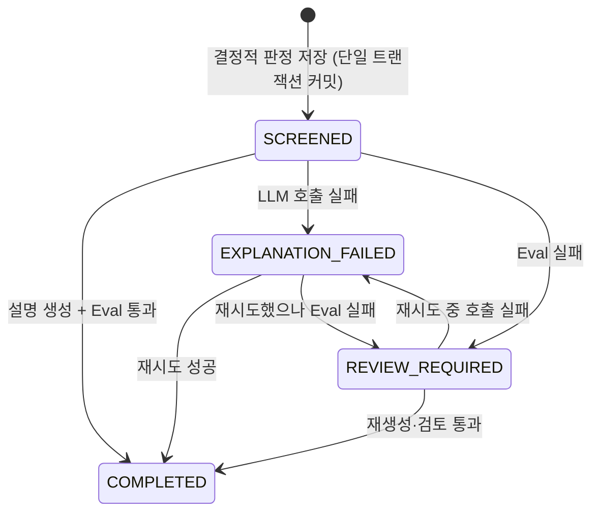

# 데이터 모델

> 세부기술서 §8의 기준안을 `/design`의 결정으로 갱신한 확정본이다.
> 충돌하면 이 문서가 우선한다. 결정의 근거와 기각한 대안은 [`설계결정.md`](설계결정.md)에 있다.
> 스키마의 진실의 원천은 Alembic 마이그레이션이며, 이 문서는 그것을 읽기 위한 지도다.

## 1. 이 모델이 지켜야 하는 것

| 지켜야 할 것 | 어디서 강제하는가 |
|---|---|
| 같은 요청이 두 번 와도 심사는 하나 | `idempotency_key` UNIQUE (ADR-004) |
| 판정은 한 번 쓰이면 바뀌지 않는다 | 갱신 경로를 만들지 않는다 — `UPDATE` 표면 없음 |
| 설명이 실패해도 판정은 남는다 | 판정과 설명을 다른 테이블로 분리 |
| 어떤 규칙·모델로 만든 결과인지 재현된다 | 버전 4종을 결과에 저장 (ADR-005) |
| 자연어 원문을 남기지 않는다 | **원문 컬럼이 존재하지 않는다** (ADR-002) |
| 재시도가 동시에 완료돼도 유효본이 하나다 | 부분 UNIQUE 인덱스 (ADR-019) |

**마지막 두 줄이 이 모델의 성격을 말해준다.** 「원문을 저장하지 않는다」는 규칙을 코드로 검사하지 않고 **컬럼을 아예 두지 않아서** 지킨다. 저장할 자리가 없으면 실수로 저장할 수 없다.

## 2. ERD

```mermaid
erDiagram
    assessment_case ||--|| decision_result : "판정 1:1"
    assessment_case ||--o{ recommendation : "추천 0..3"
    assessment_case ||--o{ explanation_run : "설명 시도 0..N"
    assessment_case }o--o| explanation_run : "현재 유효본"
    explanation_run ||--o| eval_result : "채점 0..1"

    assessment_case {
        uuid id PK
        text idempotency_key UK "중복 요청 차단"
        text request_hash "같은 키의 다른 요청 탐지"
        text status "SCREENED|COMPLETED|EXPLANATION_FAILED|REVIEW_REQUIRED"
        uuid current_explanation_run_id FK "NULL 가능 — 통과한 설명이 없으면"
        bigint monthly_income
        bigint existing_debt
        int credit_grade
        bigint requested_amount
        text employment_type
        bool collateral_owned
        timestamptz created_at
        timestamptz updated_at
    }
    decision_result {
        uuid assessment_id PK_FK
        text verdict "ELIGIBLE|CONDITIONAL|INELIGIBLE"
        text repayment_band
        numeric dsr
        jsonb monthly_payment "표시용 내역 + 가정값"
        text rule_version
        text product_dataset_version
        timestamptz decided_at
    }
    recommendation {
        uuid id PK
        uuid assessment_id FK
        text product_code
        int rank
        bool eligible
        jsonb reason_codes
    }
    explanation_run {
        uuid id PK
        uuid assessment_id FK
        text status "PENDING|RUNNING|COMPLETED|FAILED|REVIEW_REQUIRED"
        text model_name
        text prompt_version
        timestamptz started_at
        timestamptz finished_at
        int latency_ms
        int input_tokens
        int output_tokens
        text error_code "정규화된 코드 — 원문 아님"
        text explanation_text "통과한 설명만"
    }
    eval_result {
        uuid explanation_run_id PK_FK
        bool parse_accuracy
        bool verdict_consistency
        bool disclaimer_present
        bool recommendation_consistency
        bool numeric_grounding
        bool conditional_language
        bool passed
        jsonb detail "지표별 실패 근거"
    }
    audit_event {
        uuid id PK
        timestamptz occurred_at
        uuid correlation_id
        text actor_type
        text action
        text target_type
        uuid target_id
        jsonb metadata "비민감 정보만"
    }
```

`audit_event`는 다른 테이블과 FK로 묶지 않는다. 감사 이력은 대상이 삭제돼도 남아야 하고, FK를 걸면 삭제가 감사 기록을 함께 지우거나 삭제 자체를 막는다. `target_type` + `target_id`로 느슨하게 가리킨다.

## 3. 순환 참조를 어떻게 풀었는가

`assessment_case.current_explanation_run_id` → `explanation_run.id` → `explanation_run.assessment_id` → `assessment_case.id`. 형태상 순환이다.

**실제로는 순환하지 않는다.** 포인터는 **통과한 설명이 생겼을 때만** 채워지기 때문이다.

```
심사 생성 트랜잭션    assessment_case(current=NULL) → explanation_run(PENDING) → ...
설명 통과 시점        assessment_case.current_explanation_run_id = <그 run의 id>
```

`NULL` 허용이 순환을 끊는다. `DEFERRABLE` 제약이나 FK 제거 같은 수단이 필요 없다.

## 4. 상태 모델

### 4.1 심사 상태 (`assessment_case.status`)



**`RECEIVED`와 `REJECTED_INPUT`은 없다**(ADR-012). 심사 생성이 단일 트랜잭션이라 커밋 시점에 이미 `SCREENED`이므로 `RECEIVED`는 외부에서 관측되지 않는 죽은 상태였다. 입력 검증 실패는 레코드를 만들지 않고 422로 반환하므로 `REJECTED_INPUT`도 저장할 대상이 없다.

**닫혀 있는지 확인.** 시작 상태는 `SCREENED` 하나, 종착은 `COMPLETED`. 실패 두 상태는 서로 오갈 수 있고 양쪽 모두 `COMPLETED`로 나가는 길이 있다. **빠져나올 수 없는 상태가 없다.**

**어떤 상태에서도 결정적 판정은 조회된다.** 판정이 `decision_result`에 따로 있고 상태와 무관하기 때문이다.

### 4.2 설명 실행 상태 (`explanation_run.status`)

```
PENDING → RUNNING → COMPLETED
                  → FAILED            호출 실패·타임아웃·스키마 불일치
                  → REVIEW_REQUIRED   Eval 미통과
```

심사 상태와 어휘가 일부 겹치지만 **대상이 다르다** — 하나는 심사 전체, 하나는 개별 시도다. `verdict`에 `REVIEW_REQUIRED`를 쓰지 않고 `CONDITIONAL`을 쓴 이유가 이것이다(ADR-012). **판정 어휘와 상태 어휘는 겹치면 안 된다.**

## 5. 제약 — 앱과 DB 양쪽에 건다

하드닝 원칙: *「애플리케이션이 강제하는 불변식 중 DB 제약으로도 걸린 것이 하나도 없으면 결함이다.」*
**이중 방어는 중복이 아니다.** 앱 검증은 API를 거치는 요청만 막고, DB 제약은 마이그레이션 스크립트·관리 도구처럼 API를 거치지 않는 경로까지 막는다.

| 제약 | 대상 | 막는 것 |
|---|---|---|
| `UNIQUE (idempotency_key)` | `assessment_case` | 중복 심사 생성. **선조회는 최적화이지 보장이 아니다** — READ COMMITTED에서 조회와 삽입 사이에 경쟁이 있다 |
| `UNIQUE (assessment_id, product_code)` | `recommendation` | 같은 상품이 두 번 추천되는 것 |
| `UNIQUE (assessment_id, rank) WHERE eligible` | `recommendation` | 적격 추천의 순위 중복. 부적격은 순위가 없으므로 부분 인덱스 |
| `UNIQUE (assessment_id) WHERE status IN ('PENDING','RUNNING')` | `explanation_run` | **진행 중 재시도가 둘 이상 생기는 것**(ADR-019). 앱은 409로 거절하고 DB가 최종 방어선 |
| `CHECK (credit_grade BETWEEN 1 AND 10)` | `assessment_case` | 범위 밖 등급 |
| `CHECK (monthly_income >= 0 AND existing_debt >= 0 AND requested_amount >= 0)` | `assessment_case` | 음수 금액 |
| `CHECK (dsr >= 0)` | `decision_result` | 음수 DSR |
| `CHECK (rank >= 1)` | `recommendation` | 0·음수 순위 |
| `CHECK (status IN (...))` | 각 상태 컬럼 | 정의되지 않은 상태 |

### 상태를 네이티브 `ENUM`이 아니라 `TEXT` + `CHECK`로 두는 이유

| 대안 | 기각 사유 |
|---|---|
| PostgreSQL `ENUM` 타입 | 값 추가는 `ALTER TYPE`이고 **값 제거·순서 변경은 사실상 재생성**이다. `RECEIVED`를 실제로 지운 이 프로젝트에서 그 비용을 이미 겪을 뻔했다 |

`CHECK` 제약은 마이그레이션에서 갈아 끼우기 쉽고 같은 보장을 준다.

## 6. 인덱스 — 두 마이그레이션으로 나눈다

ADR-014에 따라 **정합성 제약과 성능 인덱스를 분리**한다. 처음부터 다 만들면 §18의 「인덱스 전후 `EXPLAIN ANALYZE` 비교」가 성립하지 않는다.

### 마이그레이션 1 — 정합성만

PK·FK·§5의 UNIQUE·CHECK. **조회 성능용 인덱스는 넣지 않는다.**

### 마이그레이션 2 — 성능

| 인덱스 | 대상 쿼리 |
|---|---|
| `(created_at DESC, id DESC)` | 커서 페이지네이션 기본 정렬 |
| `(status, created_at DESC, id DESC)` | 상태 필터 + 커서 |
| `explanation_run (assessment_id, started_at DESC)` | 특정 심사의 설명 이력 |
| `audit_event (correlation_id, occurred_at)` | 요청 하나를 API→AI→Eval로 추적 |

**컬럼 순서 근거(방어질문 ⑨).** 등호 조건을 앞에, 범위·정렬을 뒤에 둔다. `(status, created_at DESC, id DESC)`는 `WHERE status = ?`로 범위를 좁힌 뒤 그 안에서 이미 정렬된 상태로 읽히므로 **필터와 정렬을 인덱스 하나로 처리**한다. 순서를 뒤집으면 정렬은 타지만 필터가 전체를 훑는다.

**`id`가 마지막에 붙는 이유.** `created_at`은 유일하지 않다. 같은 시각 레코드가 둘이면 커서가 그 지점에서 흔들려 **같은 행을 두 번 주거나 건너뛴다.** 유일 컬럼을 tiebreaker로 붙여야 커서가 안정적이다.

**§8.2의 `recommendation(assessment_id, rank)`는 넣지 않는다.** §5의 부분 UNIQUE가 이미 같은 컬럼으로 인덱스를 만든다. 중복 인덱스는 쓰기 비용만 늘린다.

**측정 결과는 실행 환경·데이터 건수와 함께 기록하고 절대값을 일반화하지 않는다.**

## 7. JSONB와 정규화의 경계

ADR-006의 기준을 컬럼별로 적용한 결과다.

| JSONB | 왜 |
|---|---|
| `decision_result.monthly_payment` | 표시용 내역과 가정값. 이 값으로 검색·정렬하지 않는다 |
| `eval_result.detail` | **지표마다 실패 근거의 형태가 다르다.** 컬럼으로 고정하면 지표를 추가할 때마다 마이그레이션이 생긴다 |
| `recommendation.reason_codes` | 사유 코드 배열. 조회 조건이 아니다 |
| `audit_event.metadata` | 액션마다 부가정보가 다르다 |

| 관계형 | 왜 |
|---|---|
| `recommendation` 전체 | **JSONB 배열에는 `UNIQUE`를 걸 수 없다.** 순위 정렬·부분 인덱스도 불가 |
| `eval_result`의 6지표 | **통과율 집계와 지표별 조회가 요구사항이다.** JSONB에 넣으면 매번 추출해야 한다 |

`eval_result`가 6개 불리언 컬럼 + `detail` JSONB로 갈린 것이 이 기준의 전형이다 — **판정 자체는 집계 대상이라 컬럼, 실패 근거는 형태가 변해 JSONB.**

## 8. 정규화를 어디서 멈췄는가 (방어질문 ㉓)

**3NF까지 간다. 의도적 비정규화는 없다.**

`assessment_case`와 `decision_result`가 1:1인데 분리한 것은 정규화 규칙 때문이 아니다 — **생명주기가 다르기 때문이다.**

> 심사는 상태가 변하고(`status`, `current_explanation_run_id`, `updated_at`), 판정은 불변이다.
> 한 테이블에 두면 **불변이어야 할 행이 `UPDATE` 대상 행과 같은 자리에 있게 된다.**

「감사 대상 데이터는 갱신 대상 데이터와 같은 행에 두지 않는다」는 것이 판단 기준이고, 이건 정규형이 말해주지 않는 층위다.

`product_code`는 CSV의 상품을 가리키지만 **FK를 걸지 않는다.** 상품 데이터가 DB 테이블이 아니라 버전이 붙은 CSV이기 때문이고, 어느 버전이었는지는 `decision_result.product_dataset_version`이 갖는다. **실서비스로 가면 상품이 테이블이 되고 그때 FK와 스냅샷 전략이 함께 필요해진다** — 리스크 대장 C2의 ③칸에 해당한다.

## 9. UUID를 PK로 쓰는 판정 (방어질문 ㉕)

**결정: UUIDv4를 쓴다. 다만 대가를 알고 쓴다.**

| 판정 칸 | 내용 |
|---|---|
| 무엇이 문제인가 | UUIDv4는 무작위라 B-tree 삽입 위치가 흩어진다. **페이지 분할이 잦아 쓰기가 느려지고 인덱스가 팽창**한다. 순차 키(`bigserial`)에는 없는 비용이다 |
| 가치가 생기는 조건 | 대안(UUIDv7·ULID 등 시간정렬 UUID)의 이득은 **수백만 행 규모**에서 관측된다 |
| 이 프로젝트의 조건 | §18의 성능 실험이 **10,000건**이다. 이 규모에서는 차이가 측정되지 않는다 |
| 지금 넣는 비용 | 표준 라이브러리에 없어 의존성이나 자체 생성기가 필요하다. **쓰지 않는 구조를 먼저 들이는 것** |
| 판정 | **보류.** 사유를 기록한다 |

`bigserial`을 쓰지 않는 이유는 따로 있다. **순차 정수 ID는 총건수를 노출하고 다음 값을 추측할 수 있게 한다.** 인증이 없는 데모(ADR-009)에서 추측 가능한 식별자는 더 나쁘다 — 다만 **추측 난이도는 접근 통제가 아니며**, 그 점은 ADR-009에 그대로 적혀 있다.

## 10. 저장하지 않는 것

**컬럼이 없다는 사실 자체가 통제다.** 아래 항목은 어느 테이블에도 자리가 없다.

- 자연어 상담 원문 · 전체 프롬프트 (ADR-002)
- 실명·주민등록번호·계좌번호·연락처
- API 키
- LLM 제공자 오류 **원문** — `error_code`에 정규화된 코드만 남긴다
- 통과하지 못한 설명문 — `explanation_text`는 Eval 통과분만 채워진다 (ADR-007)

**검증 방법:** 마이그레이션에 해당 컬럼이 없음을 확인한다. 코드 검사보다 강한 보장이다.
