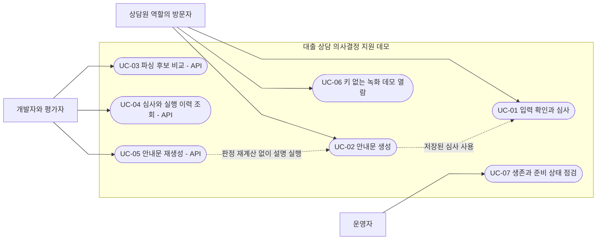

# 문제 정의와 Use Case

[개발자 가이드](개발자_가이드.md) → 문제 정의 → [아키텍처](아키텍처.md)

## 문제와 대상

이 프로젝트가 다루는 문제는 **자연어 상담 정보를 잘못 읽거나, LLM의 설명이 계산 결과와 달라져도 그 차이를 발견하기 어렵다는 것**이다. 구조화 입력 확인, 결정적 판정, 설명 검증을 분리해 각각의 책임과 실패를 드러낸다.

주 사용자는 상담원 역할을 체험하는 데모 방문자다. 개발자·평가자는 API와 저장 이력으로 동작을 확인하고, 운영자는 상태 점검 경로를 사용한다. 이 역할은 사용 시나리오의 구분이며 인증된 계정·권한 모델이 아니다. 실제 금융기관 상담원 인터뷰나 업무시간 절감 실험을 수행했다는 주장은 하지 않는다.

## Pain Point와 대응

| Pain Point | 근거의 성격 | 구현한 대응 | 남는 한계 |
|---|---|---|---|
| 자연어 금액의 단위·자리수를 잘못 읽으면 판정 입력부터 달라진다 | 녹화된 파싱 후보와 규칙 파서 회귀 테스트 | 규칙 파서로 폼 채우기, 사람의 수정·금액 확인. API에서는 독립적인 LLM 후보와 불일치 반환 | 두 후보가 같아도 정답이라는 보장은 없다. 공개 화면에는 두 후보 비교가 연결되지 않았다 |
| 생성형 모델이 판정·숫자·상품을 임의로 바꿀 수 있다 | 설계상 통제 대상, Eval 결함 주입 테스트 | 판정·DSR·추천을 코어 함수로 확정하고 LLM에는 저장된 결과만 주입. 안내문은 Eval 통과 후 저장 | 검증 지표 밖의 문장 오류를 모두 검출하지는 못한다 |
| 더블클릭·네트워크 재전송으로 같은 심사가 중복 저장될 수 있다 | API 멱등성·동시성 테스트 | `Idempotency-Key` + 정규화 요청 해시 + DB UNIQUE | 서로 다른 키로 보낸 같은 입력은 별개 심사다 |
| 외부 모델이 실패하면 판정까지 다시 계산하거나 잃을 수 있다 | 워커 장애·재시도 테스트 | 판정과 설명 시도를 분리하고, 판정 저장 시 PENDING 작업을 같은 트랜잭션에 생성 | 공개 배포에는 워커가 없어 키 없는 심사의 PENDING이 자동 처리되지 않는다 |
| 결과만 남으면 어떤 규칙·상품·모델로 설명했는지 확인하기 어렵다 | 저장 모델·조회 API·통합 테스트 | 판정에 규칙·상품 버전, 설명 시도에 모델·프롬프트 버전·지연·토큰·오류·Eval 저장 | 버전 식별자만으로 과거 코드·모델의 완전한 재현까지 보장하지 않는다 |
| 평가자가 API 키를 준비하지 않으면 결과를 확인하기 어렵다 | 데모 경로·키 없는 화면 분기 | 결정적 심사와 사전 녹화 결과를 키 없이 제공 | 녹화 결과 열람은 새로운 LLM 실행의 성공 증거가 아니다 |

근거: [녹화 픽스처](../loan_agent/demo_fixtures.json), [파서 테스트](../tests/test_parser.py), [Eval 테스트](../tests/test_eval.py), [심사 테스트](../tests/test_assessments.py), [워커 테스트](../tests/test_worker.py), [화면 구현](../loan_agent/app.py).

## Use Case 맵

Mermaid flowchart로 표현한 역할·기능 맵이다. 엄밀한 UML Use Case 표기 대신, 제공 채널을 함께 드러낸다.

## 주요 시나리오

| ID / 요구사항 | 사전 조건·입력 | 정상 흐름과 결과 | 대안·실패 흐름 |
|---|---|---|---|
| UC-01 / R1·R2 | 합성 월소득·부채·등급·희망금액·직장유형·담보 여부 | 선택적으로 자연어에서 폼을 채움 → 사람이 수정·금액 확인 → 구조화 입력 제출 → 판정·추천·PENDING 저장 → 결과 표시 | 필드 검증 실패는 422, 저장 없음. 같은 키·같은 입력은 기존 심사 200, 다른 입력은 409 |
| UC-02 / R6 | 저장된 심사와 방문자 OpenAI 키 | 기존 PENDING 확보 → 저장된 판정으로 안내문 생성 → Eval → 통과분 저장·표시 | 제공자 오류는 FAILED, Eval 실패는 REVIEW_REQUIRED. 판정은 보존. 동기 실행 상한 초과는 503 |
| UC-03 / R5 | 자연어 `text`, 선택적 방문자 키 | 규칙 후보 생성 → 키가 있으면 LLM 후보 생성 → 불일치·누락 필드 반환 → 호출자가 사람에게 확인받음 | 키 없음은 규칙 후보만 200·`degraded=true`. 키를 보냈는데 파서 호출이 실패하는 경우 자동 폴백은 구현되지 않음 |
| UC-04 / R3·R4·R7 | 심사 UUID 또는 상태·기간·커서 | 목록 조회 → 상세 판정·추천 조회 → 설명 시도와 Eval 확인 | 빈 목록은 200, 잘못된 UUID·필터는 422, 없는 심사는 404 |
| UC-05 / R6 | 기존 심사, 설명 재시도 필요 | 방문자 키 경로는 동기 실행, 키 없는 경로는 새 PENDING을 만들고 로컬 워커가 처리 | 유효한 RUNNING과 충돌하면 409. 키 없는 경로는 PENDING이 이미 있어도 409 |
| UC-06 / R9 | 키 불필요 | 사전 녹화 픽스처를 읽고 녹화 결과임을 표시 | 새로운 심사 저장·LLM 호출을 하지 않는 열람 경로 |
| UC-07 / R10 | API 프로세스 접근 가능 | live는 생존 200, ready는 DB 연결·마이그레이션 확인 후 200 | DB·스키마 준비 실패는 ready 503. LLM은 readiness 검사 대상에서 제외 |

R 번호는 [SPEC.yaml](../SPEC.yaml)의 요구사항 번호다. 각 HTTP 요청의 필드·코드·예제는 [API 명세서](API_명세서.md)에 있다.

## 성과로 주장할 수 있는 범위

이 포트폴리오가 보여주는 것은 실패 경계와 검증 가능한 구현이다. 업무시간 단축률, 실대출 승인 정확도, 개인정보 처리 적법성, 상용 서비스 수준의 가용성을 입증한 프로젝트로 설명하지 않는다. 자동화 테스트와 녹화 Eval의 측정 범위는 [평가 리포트](평가리포트.md), 실서비스 전환 시 조건은 [리스크 통제 대장](리스크_통제_대장.md)을 참고한다.
