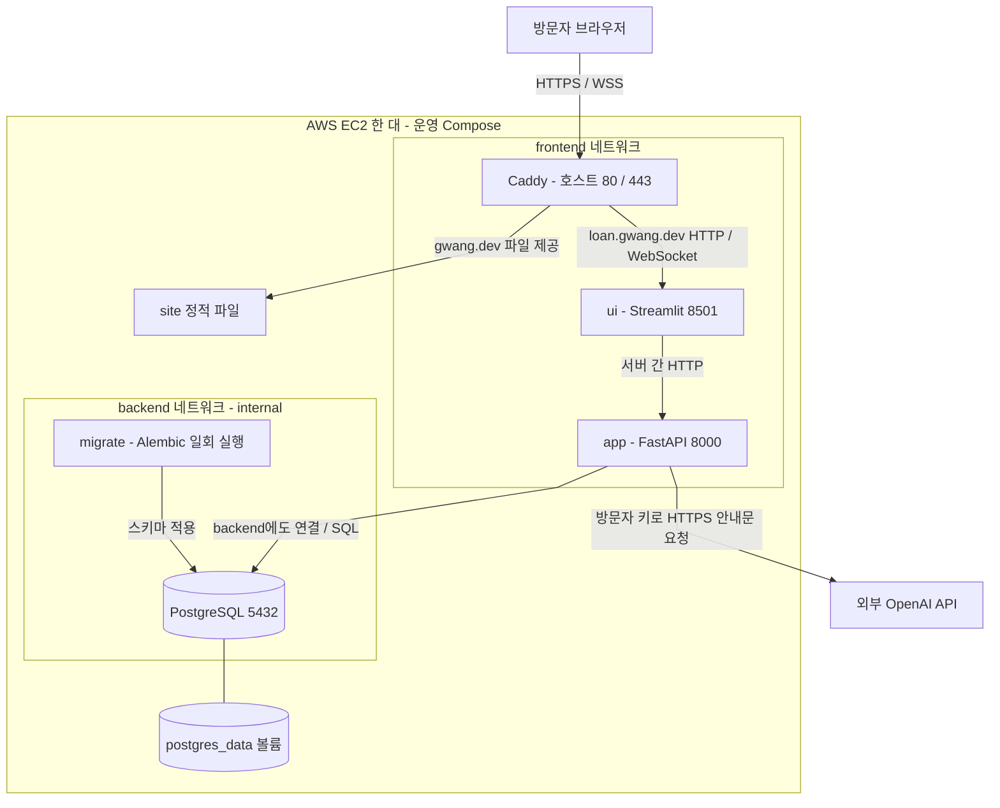
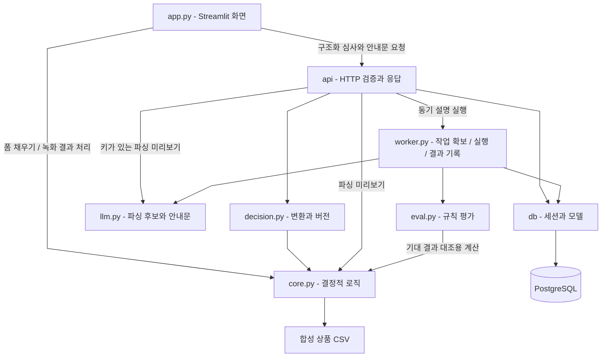
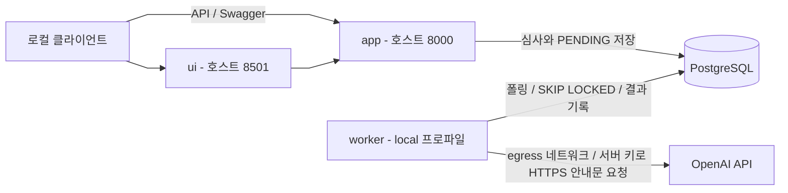

# 아키텍처

[개발자 가이드](개발자_가이드.md) · [문제와 Use Case](서비스_문제와_유스케이스.md) → 아키텍처 → [데이터 흐름](데이터_흐름.md)

## 공개 배포 구성

아래 그림은 저장소의 운영 Compose와 Caddy 설정을 표현한다. **공개 진입점은 Caddy, HTTP API 호출자는 Streamlit 서버**다. API와 DB를 브라우저가 직접 호출하는 구조가 아니다.

- `app`은 frontend와 backend 양쪽에 연결한다. `ui`와 `caddy`는 frontend만, `postgres`와 `migrate`는 backend만 사용한다.
- 운영에서는 80·443만 호스트에 게시한다. 8000·8501·5432는 운영 Compose의 호스트 포트가 아니다.
- `postgres` 준비 → `migrate` 성공 → `app` 기동 순서다. Caddy는 UI 기동에 의존하지 않으므로 앱 장애 중에도 정적 포트폴리오를 제공할 수 있다. EC2·Caddy 자체의 장애까지 격리하는 것은 아니다.
- 이 구성에는 서버 OpenAI 키와 별도 워커가 없다. 방문자 키는 브라우저 입력에서 Streamlit 서버 메모리로 전달되고, `X-OpenAI-API-Key` 헤더로 app에 전달된다. 이후 제공자 인증에 쓰이며 DB에 저장하지 않는다. Caddy 뒤의 컨테이너 간 HTTP 구간은 TLS가 아니다.

근거: [공통 Compose](../docker-compose.yml), [운영 Compose](../docker-compose.prod.yml), [Caddyfile](../Caddyfile), [Streamlit 호출부](../loan_agent/app.py).

## 모듈과 책임

화살표는 주요 호출·데이터 사용 관계다. 모든 Python import를 나열한 그래프는 아니다. 결정적 심사 경로는 `assessments → decision → core`이며 LLM을 호출하지 않는다. `worker.py`는 공개 app 안에서 함수로 호출되는 실행기이기도 하고, 로컬에서 별도 프로세스로 기동되는 워커이기도 하다.

| 경계 | 담당 | 선택의 이유 / 전환 조건 |
|---|---|---|
| 화면 ↔ API | Streamlit / FastAPI | 화면이 DB 모델을 직접 다루지 않고 HTTP 계약 사용. 규칙 파서와 녹화 렌더링에는 core를 직접 사용 |
| 판정 ↔ 설명 | core·decision / llm·worker | 제공자 실패와 생성 문장의 오류가 저장된 판정의 변경 경로가 되지 않도록 분리 |
| API ↔ 워커 | 같은 코드베이스, 실행 주체만 분리 | 공개 방문자 키는 요청 안에서 소비. 로컬 서버 키는 워커가 소비 |
| 작업 발행 ↔ DB | explanation_run이 아웃박스 역할 | 판정과 작업을 같은 트랜잭션에 저장. 별도 메시지 브로커 없음 |
| 애플리케이션 ↔ DB | SQLAlchemy / PostgreSQL | 멱등성과 진행 중 작업의 유일성을 DB 제약으로 보강 |

세부 근거와 기각 대안은 [설계 결정](설계결정.md)의 ADR-001·003·011·023·024·029·030·031에 있다. 독립 배포, 확장·보안 요구의 분리, 프로세스 장애 격리 필요가 커지면 모듈러 모놀리스 선택을 재검토한다.

## 로컬 비동기 구성과 차이

| 항목 | 공개 배포 | 로컬 `--profile local` |
|---|---|---|
| 진입점 | Caddy HTTPS, 화면만 공개 | 8501 화면·8000 API 게시 |
| 별도 워커 | 없음 | 포함 |
| 안내문 실행 | 방문자 키를 받은 app의 동기 실행 | 서버 키를 사용하는 워커의 비동기 실행, 방문자 키 API도 존재 |
| DB 포트 게시 | 없음 | 없음 |
| 키 없이 심사 생성 후 | PENDING이 남음 | 워커가 작업 확보 |
| 모델 제공자로 나가는 네트워크 | `app`의 frontend | `app`의 frontend, 워커 전용 `egress` |

**로컬 워커의 네트워크:** worker는 DB에 닿는 `backend`(internal)와 외부 통신 전용 `egress`에 연결된다. `backend`에만 두었을 때는 이름 해석부터 되지 않아 서버 키 호출이 `PROVIDER_ERROR`로 끝났다. `egress`에는 다른 서비스를 두지 않는다 — 들어오는 경로인 frontend에 워커를 붙이면 화면까지 닿게 되기 때문이다([ADR-035](설계결정.md#adr-035-워커의-외부-통신은-전용-네트워크로-연다--데이터-계층-격리는-그대로)). 서버 키가 없는데 워커를 켜면 작업을 확보한 후 `PROVIDER_ERROR`로 실패할 수 있다.

근거: [로컬 override](../docker-compose.override.yml), [워커 서비스와 네트워크](../docker-compose.yml), [키 선택](../loan_agent/llm.py), [워커 실행](../loan_agent/worker.py).

## 장애와 운영 경계

| 상황 | 영향과 관측 수단 |
|---|---|
| LLM 제공자 장애 | 설명 실행 상태와 오류 코드에 기록. 결정적 판정은 보존되며 readiness는 LLM을 검사하지 않음 |
| DB 연결·스키마 문제 | 심사 저장·조회에 영향. `/health/ready` 503, `/health/live`는 프로세스 생존만 확인 |
| UI·API 장애 | 서비스 화면에 영향. 정적 호스트는 같은 Caddy에서 별도 파일 제공 |
| 요청 폭주 | 토큰 사용 가능 POST 경로를 API 프로세스 메모리에서 주소별 제한. 공개 구성에서는 UI 주소를 공유하므로 사실상 전체 상한 |
| EC2·Caddy 장애 | 두 호스트에 함께 영향. 다중 인스턴스·자동 장애조치 구성 없음 |

로그는 [요청 로그 미들웨어](../loan_agent/api/request_log.py), 점검은 [health 라우터](../loan_agent/api/health.py), 상한은 [limits](../loan_agent/api/limits.py), 실제 기동·복구는 [배포 절차서](배포절차.md)를 따른다.
